# DineStack

DineStack is a modern full-stack restaurant management and food ordering platform designed with production-style architecture, secure authentication, and a polished SaaS-inspired user experience.

---

## Features

### Authentication & Security
- JWT Authentication (Access + Refresh Tokens)
- Secure Password Hashing
- Protected API Routes
- Role-Based Authorization (Customer / Staff / Admin)
- Email Verification System
- Password Reset Flow
- Session Persistence & Auto Refresh
- Multi-Tab Authentication Synchronization

### Customer Features
- Browse Dynamic Restaurant Menu
- Category-Based Menu Filtering
- Search Menu Items
- Shopping Cart System
- Real-Time Cart Updates
- Place Orders
- Reservation Booking System
- Order History Tracking
- Customer Profile Management
- Mobile-Responsive Experience

### Staff Features
- Staff Order Management
- Reservation Handling
- Mark Menu Items Out of Stock
- Real-Time Menu Availability Updates

### Admin Features
- Full Admin Dashboard
- User Management System
- Order Analytics
- Menu CRUD Management
- Reservation Management
- Role Promotion / Demotion
- Admin-Level Access Control

### Backend Engineering
- RESTful API Architecture
- FastAPI Backend
- PostgreSQL Database
- SQLAlchemy ORM
- Modular Backend Structure
- Dockerized Full Stack Environment
- Persistent Docker Volumes
- Image Upload System
- API Documentation with Swagger/OpenAPI
- Secure Environment Variable Management

### UI / UX
- Modern SaaS-Inspired Interface
- Dark Premium Theme
- Responsive Mobile-First Design
- Animated Loader Screen
- Empty State UI
- Glassmorphism-Inspired UI Components
- Custom Logo & Branding
- Consistent Spacing & Design System
---

## Tech Stack

### Frontend
- React 19
- Vite
- Tailwind CSS

### Backend
- FastAPI
- Uvicorn
- SQLAlchemy
- PostgreSQL

### DevOps & Infrastructure
- Docker
- Docker Compose

---

## Architecture

Frontend → React + Vite  
Backend → FastAPI REST API  
Database → PostgreSQL  
Containerization → Docker Compose

---

## API Documentation

FastAPI automatically generates interactive API documentation.

- Swagger UI → `http://localhost:8000/docs`
- ReDoc → `http://localhost:8000/redoc`

## Deployment Ready

- Dockerized frontend & backend
- Persistent PostgreSQL volumes
- Persistent image uploads
- Environment-based configuration
- Production-friendly project structure

## Screenshots

### Home Page
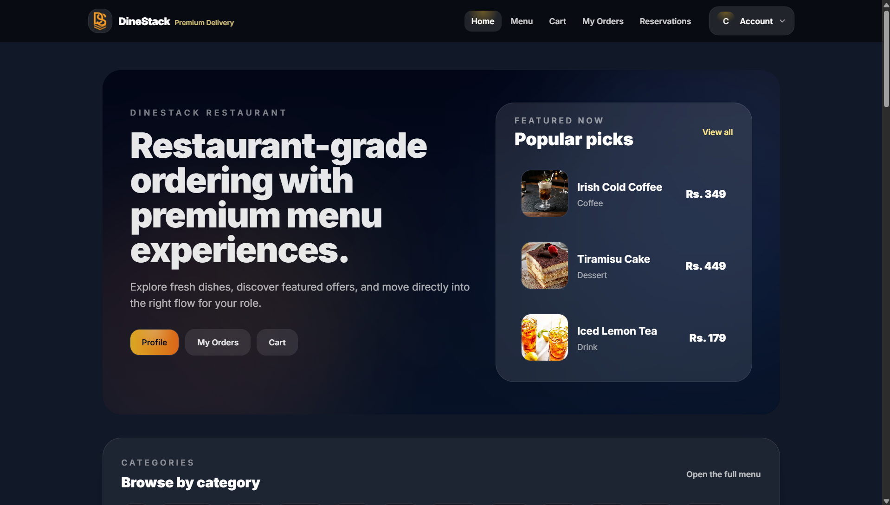

### Login Page
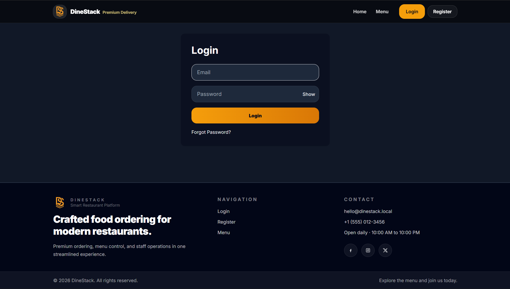

### Menu Page
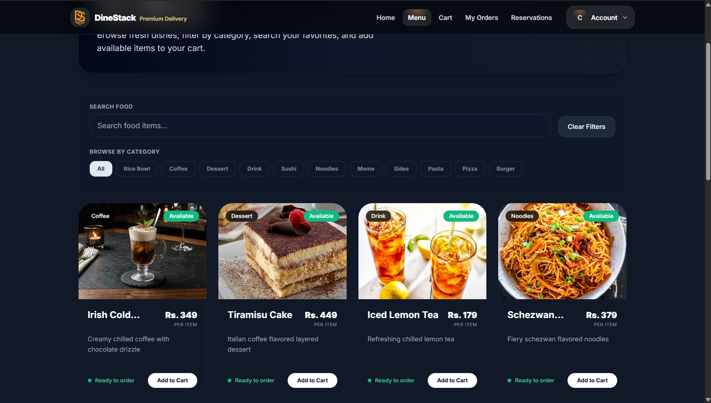

### Cart System
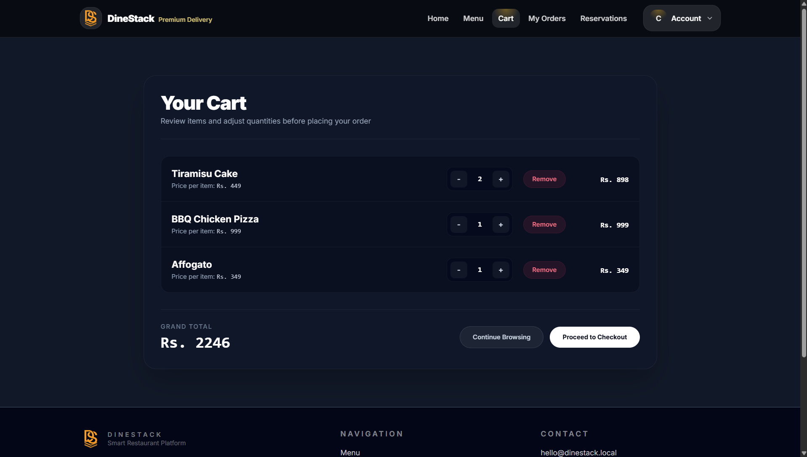

### My Orders
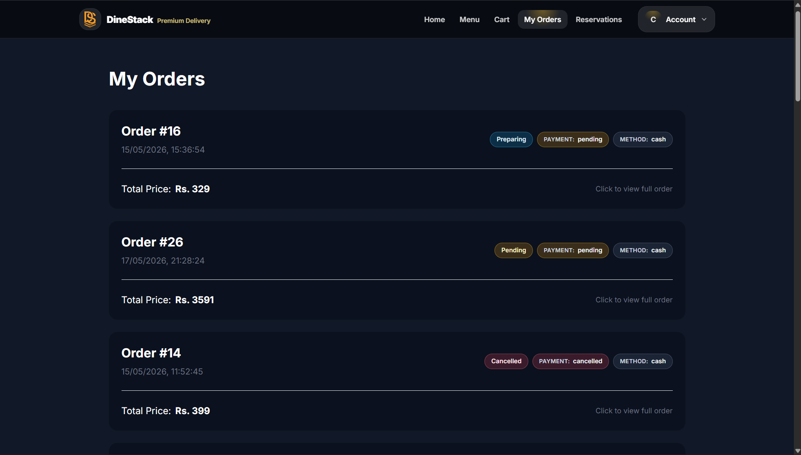

### Reservation System
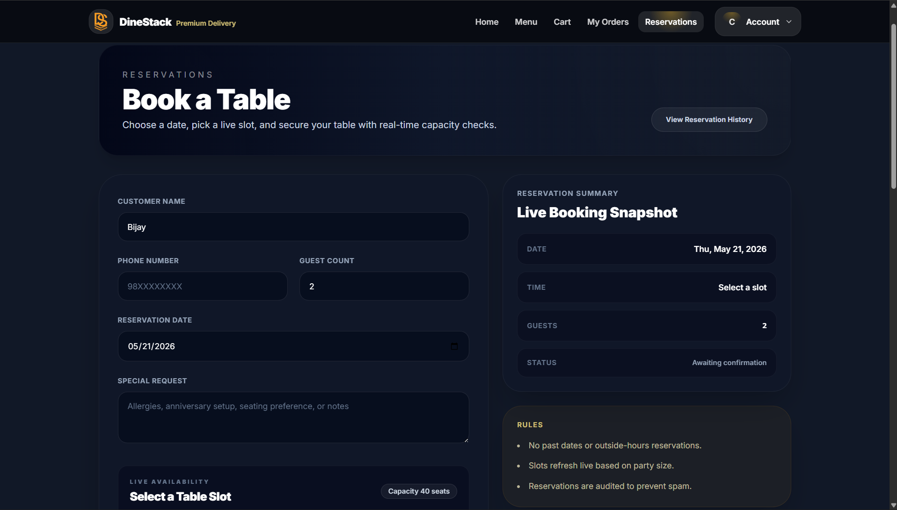

### Add Menu Item
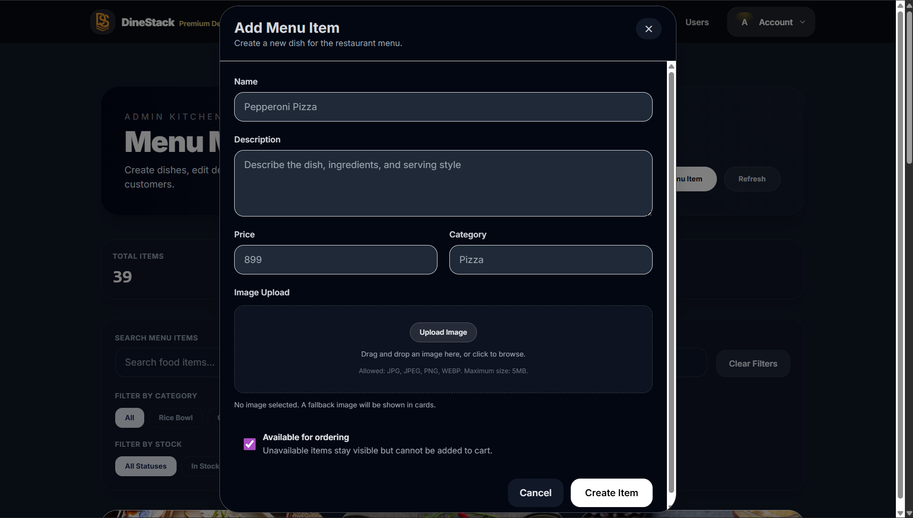

### Admin Dashboard
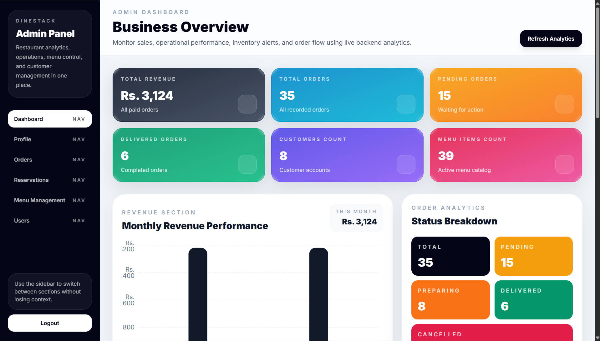

### Admin Menu Management
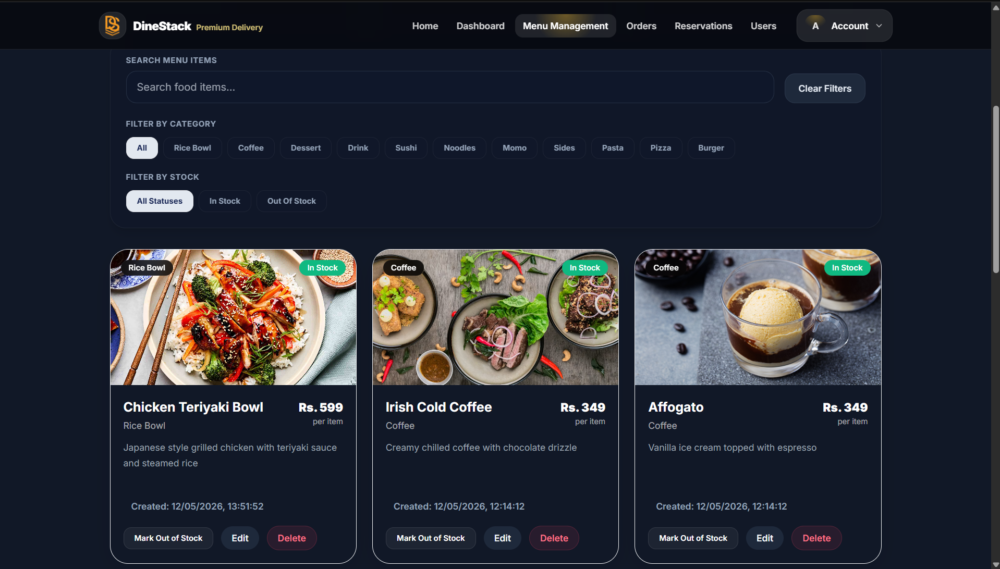

### Staff Menu Management
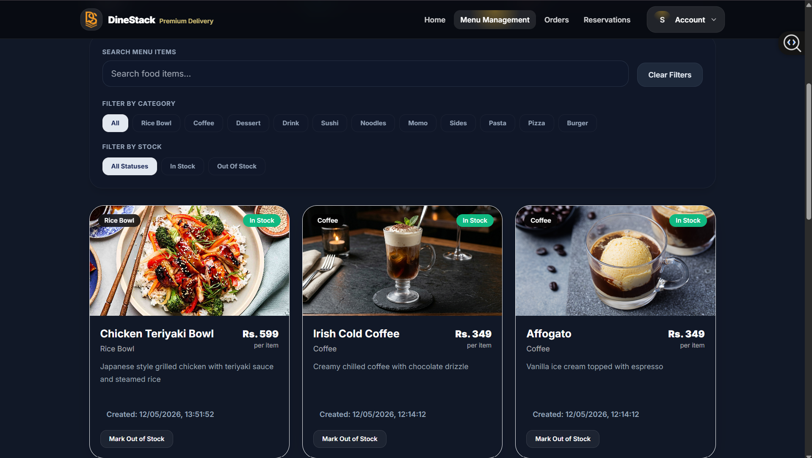

### Order Management
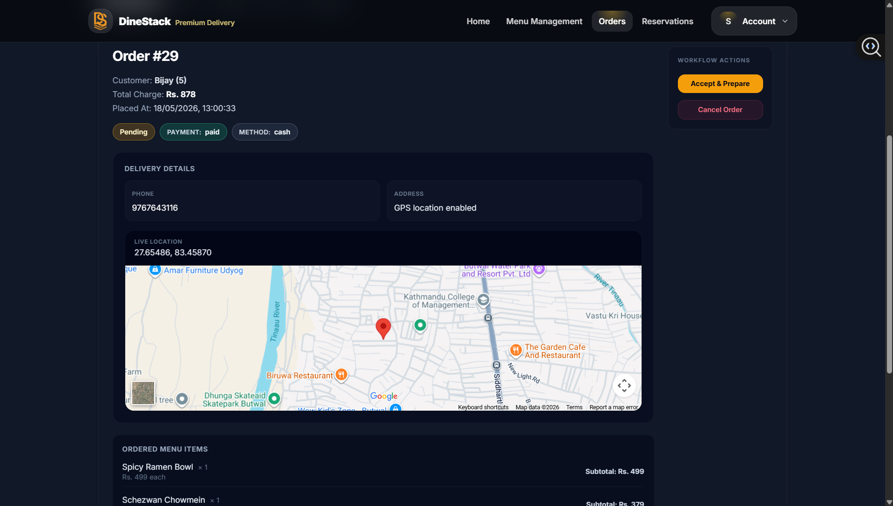

### Reservation Management
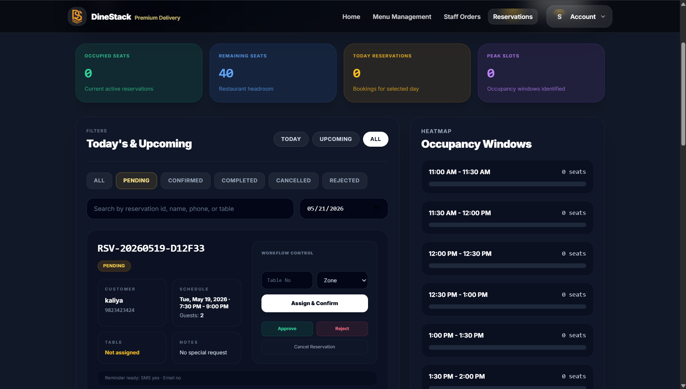

### User Management
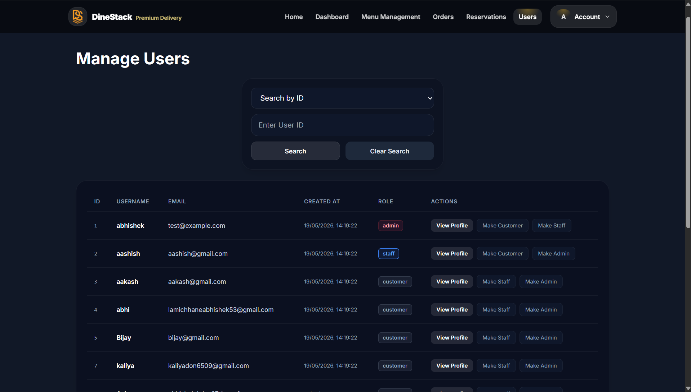

### Change Password
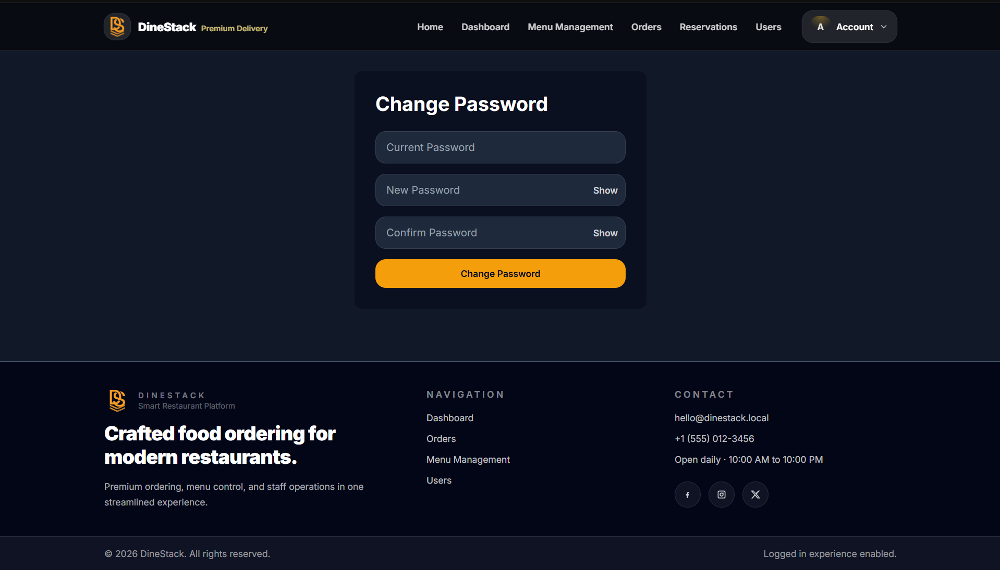

### Mobile Responsive UI
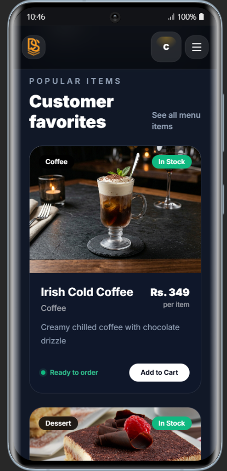

---

## Project Structure
```bash
DineStack/
├── backend/
│   ├── auth/
│   │   ├── auth_bearer.py
│   │   ├── auth_routes.py
│   │   ├── jwt_handler.py
│   │   ├── role_checker.py
│   │   └── staff_or_admin.py
│   │
│   ├── database/
│   │   ├── connection.py
│   │   └── dependencies.py
│   │
│   ├── models/
│   │   ├── menu_model.py
│   │   ├── order_model.py
│   │   ├── reservation_model.py
│   │   ├── payment_model.py
│   │   ├── refresh_token_model.py
│   │   └── user_model.py
│   │
│   ├── routes/
│   │   ├── menu_routes.py
│   │   ├── order_routes.py
│   │   ├── reservation_routes.py
│   │   ├── payment_routes.py
│   │   ├── user_routes.py
│   │   └── admin_user_routes.py
│   │
│   ├── schemas/
│   ├── utils/
│   ├── uploads/
│   │   └── menu_items/
│   │
│   ├── main.py
│   ├── requirements.txt
│   └── Dockerfile
│
├── frontend/
│   ├── src/
│   │   ├── components/
│   │   │   ├── admin/
│   │   │   ├── Navbar.jsx
│   │   │   ├── Footer.jsx
│   │   │   └── LoaderScreen.jsx
│   │   │
│   │   ├── context/
│   │   │   ├── AuthContext.jsx
│   │   │   └── CartContext.jsx
│   │   │
│   │   ├── hooks/
│   │   │   └── useRole.js
│   │   │
│   │   ├── layouts/
│   │   │   └── MainLayout.jsx
│   │   │
│   │   ├── pages/
│   │   │   ├── admin/
│   │   │   ├── Home.jsx
│   │   │   ├── Menu.jsx
│   │   │   ├── Cart.jsx
│   │   │   ├── Checkout.jsx
│   │   │   ├── Login.jsx
│   │   │   ├── Register.jsx
│   │   │   ├── Profile.jsx
│   │   │   ├── Reservations.jsx
│   │   │   └── MyOrders.jsx
│   │   │
│   │   ├── routes/
│   │   │   └── ProtectedRoute.jsx
│   │   │
│   │   ├── services/
│   │   │   ├── api.js
│   │   │   ├── authService.js
│   │   │   ├── menuService.js
│   │   │   ├── orderService.js
│   │   │   ├── paymentService.js
│   │   │   └── reservationService.js
│   │   │
│   │   ├── utils/
│   │   ├── App.jsx
│   │   └── main.jsx
│   │
│   ├── public/
│   ├── package.json
│   ├── vite.config.js
│   ├── tailwind.config.js
│   └── Dockerfile
│
├── screenshots/
│   ├── home.png
│   ├── menu.png
│   ├── admin-dashboard.png
│   ├── order-management.png
│   ├── reservation-management.png
│   └── mobile-responsiveness-ui.png
│
├── docker-compose.yml
├── .env
└── README.md
```

## Local Development Setup

### Clone Repository

```bash
git clone https://github.com/abhishekldev07/DineStack
cd DineStack
```

### Start Docker Containers

```bash
docker compose up --build
```

- Backend API → `http://localhost:8000`
- Frontend → `http://localhost:5173`

---

## Author

Developed by **Abhishek Lamichhane**.

Built as a production-style portfolio project focused on full-stack engineering, authentication architecture, and scalable SaaS-inspired UI/UX.